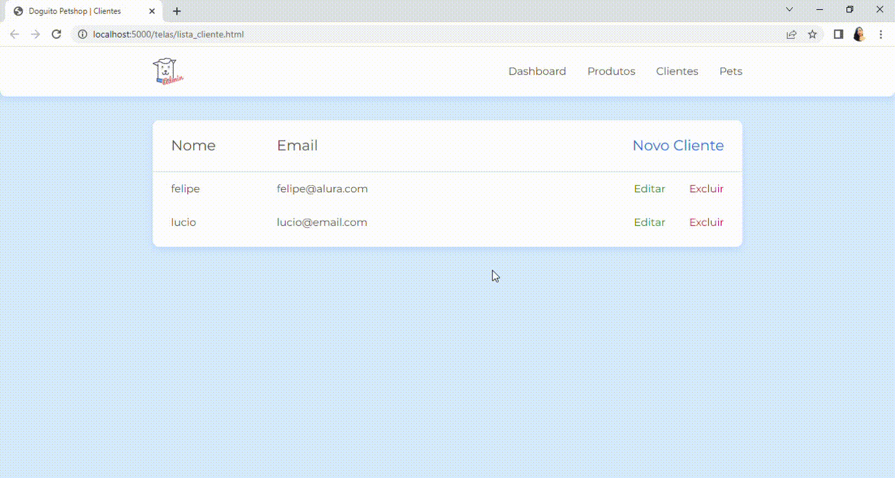

# Programa Desenvolve 2023 - JS na web: CRUD com JavaScript assíncrono

Repositório criado com o objetivo de registrar meu progresso no Programa Desenvolve 2023 do Grupo Boticário em parceira com a Alura praticando o que foi abordado nas aulas do curso: <br> 
JS na web: CRUD com JavaScript assíncrono, implementando CRUD com JavaScript assíncrono para listar, criar, atualizar e deletar clientes num cadastro. <br>

## Para rodar o programa:

Abrir a pasta crud-com-js-assincrono-main no vscode e 
rodar o json server: 

```js
json-server --watch db.json
```

E o browser: 
```
browser-sync start --server --file . --host --port 5000 --startPath telas/lista_cliente.html
```
<br>



## Tecnologias utilizadas durante o curso

* JavaScript

## Tecnologias utilizadas no projeto
* HTML
* CSS

## Tópicos abordados no curso:

* Comunicação assíncrona <br>
* Fetch API <br>
* Criar e remover clientes <br>
* Editar dados <br>
* Async/Await 


